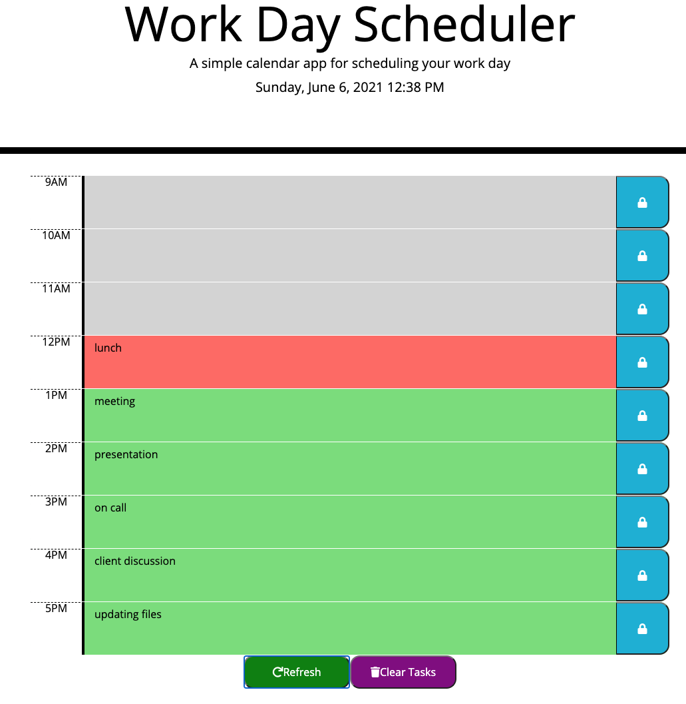
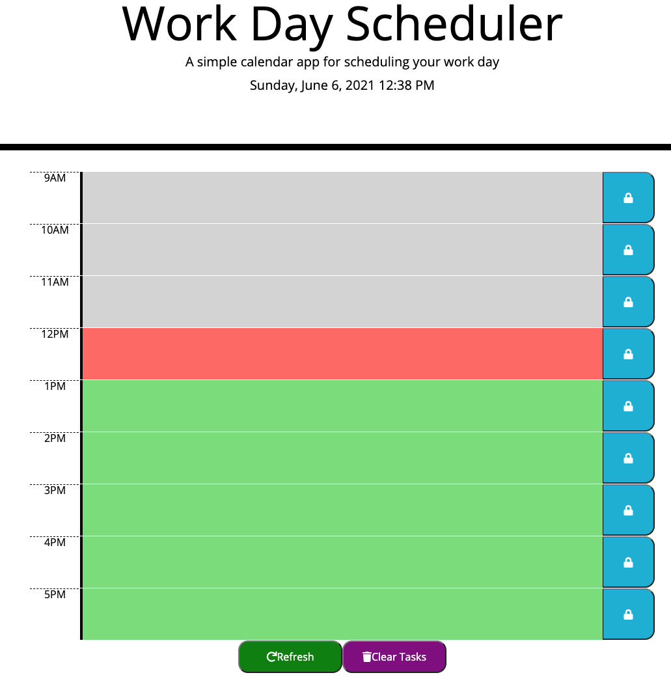

# Work-Day-Scheduler

## About this challenge
This challenge is to create a daily planner, for an employee with a busy schedule.
This planner helps the user to add important events manage my time effectively.

## In this Challenge

- When the user opens the planner, then the current day is displayed at the top of the calendar.

- When the user scrolls down, then presented with time blocks for standard business hours.

- When the user view the time blocks for that day, then each time block is color-coded to indicate whether it is in the    past, present, or future.

- When user clicks into a time block, then I can enter an event.

- When user click the save button for that time block, then the text for that event is saved in local storage.

- When the user refresh the page, then the saved events persist.

- When the user click on the clear button, it clears the local storage and refreshes the page and the tasks are emptied to start new.

## My Password-Generator Mock up

## Technologies Used:
- HTML
- CSS
- jQuery
- Bootstrap

#### Sindhu Pillai